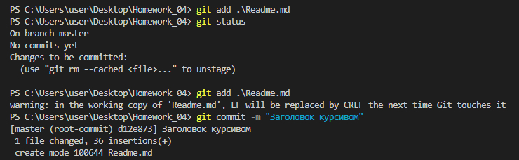

# *Инструкция для работы с Git и удалёнными репозиториями*

## Что такое Git?
**Git** - это одна из реализаций распределённых систем контроля версий, имеющая как локальные, так и удалённые репозитории. Является самой популярной реализацией систем контроля версий в мире.
## Подготовка репозитория
Для создания репозитория необходимо выполнить команду *git init*  в папке с репозиторием, и у Вас создаcтся репозиторий (появится скрытая папка .git).

## Создание коммитов

1. ### Git add
Для добавления изменений в коммит используется команда *git add*. Чтобы использовать команду *git add*, напишите *git add <имя файла>*.

2. ### Просмотр состояния репозитория
Для того, чтобы посмотреть состояние репозитория, используется команда *git status*. Для этого необходимо в папке с репозиторием написать *git status*, и Вы увидите, были ли изменения в файлах, или их не было.

3. ### Создание коммитов
Для того, чтобы создать коммит (сохранение), необходимо выполнить команду *git commit*. Выполняется она так: *git commit -m "<сообщение к коммиту>*. Все файлы для коммита должны быть ***ДОБАВЛЕНЫ***, и сообщение к коммиту писать ***ОБЯЗАТЕЛЬНО***.

## Перемещение между сохранениями
Для того, чтобы перемещаться между коммитами, используется команда *git checkout*. Используется она в папке с репозиторием следующим образом: *git checkout <номер коммита>*.

## Журнал изменений
Для того, чтобы посмотреть все сделанные изменения в репозитории, используется команда *git log*. Для этого достаточно выполнить команду *git log* в папке с репозиторием.

## Ветки в Git

### Создание ветки

Для того, чтобы создать ветку, используется команда *git branch*. Делается это следующим образом в папке с репозиторием: *git branch <название новой ветки>*.

### Слияние веток

Для того, чтобы дабавить ветку в текущую ветку, используется команда *git merge <name branch>*.

### Удаление веток
Для удаления ветки: ввести команду "git branch -d 'name branch'".

## Работа с удаленными репозиториями

### Как сделать свой вклад в чужой проект на GitHub

1. Находим интересующий нас проект-репозиторий на сайте github.com и нажимаем на кнопку "Fork". В нашем аккаунте появляется копия того чужого репозитория, с который и будем дальше работать.

2. Открываем программу Visual Studio Code, выбираем опцию "Clone Git repository", в появившееся окошко "Clone" вставляем ссылку на наш репозиторий (или можно в терминале набрать команду git clone <ссылка>). На компьютере появляется папка с файлами из репозитория.

3. После внесения изменений в файлы в Visual Studio Code, набираем команду git push - и изменения отправляются в наш удаленный репозиторий в GitHub.

4. В GitHub выбираем опцию "Pull Request" - тем самым отправляем изначальному автору проекта, который мы скопировали, предложение принять наши изменения.