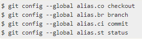

# Создание псевдонимов с помощью команды git config

Команда __git config__ отлично подходит для быстрого создания псевдонимов.
Мы хотим представить функцию, которая может сделать вашу работу с Git проще, понятнее и привычнее: псевдонимы.

Git не выводит автоматически вашу команду, если вы вводите ее частично. Если вы не хотите вводить весь текст каждой из команд Git, вы можете легко настроить псевдоним для каждой команды с помощью git config.

Вот пара примеров, которые вы, возможно, захотите настроить:

